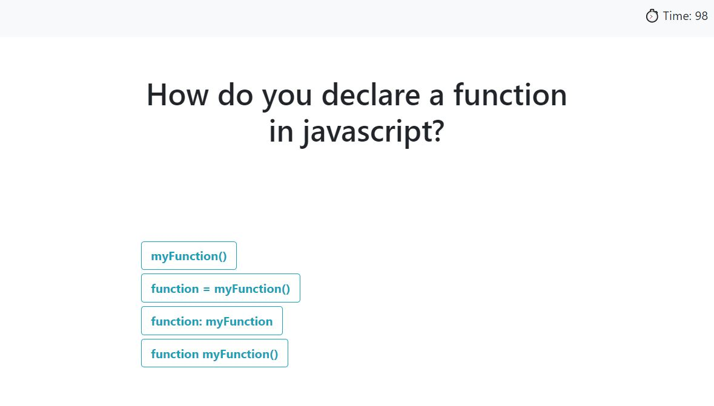

# JsCodingQuiz
[View deployed application](https://rsowald.github.io/JsCodingQuiz)

## About this Project
This is a quiz on Javascript coding fundamentals built to showcase HTML DOM methods in Javascript.

This project was designed  as a practical test of my ability to use JS as much as it was to create a written test of JS knowledge. In the software design world, it is quite common to be asked to do an assessment of fundamentals as part of an early screening process. Questions range from simple true/false and definition questions to mini live coding challenges that are sent to a candidate before any whiteboarding or behavioral interview is even offered.

So, to test my own ability and create a quiz for a user, I started from scratch with a simple Bootstrap styled UI that would update the HTML and CSS dynamically with Javascript. Some of the JS methods I used are:
- Query selectors
- Writing to and retrieving from local storage with JSON
- Inner HTML, createElement, appendChild and textContent to write content to the HTML
- Event listeners
- setAttribute and removeAttribute to dynamically change classes

I used these methods to develop a quiz with simple functionality. First, the quiz loads on a starting div with a header that includes a link to a high scores modal. When the user clicks the start button, a timer starts, the high scores button disappears, and the first question appears by changing classes on the respective divs. I put an event listener on the whole quiz div so that When the user clicks any answer button, the event is captured by one listener then I run a function to check the value of the element they clicked on to compare to a answer key. Then, a correct or wrong message will alert as the next question appears. If the answer was incorrect, a time penalty is deducted. If all the questions are answered or the timer reaches 0, a Game Over div appears by once again changing the hide class, and the user can input their initials and save their score to the high scores list. Because the high scores are saved in local storage, the user can come back to the application at a later time and try to improve their knowledge and their score.

## Usage
The application begins on the landing div:

After the start button is clicked, the timer starts and the first question appears:

If the timer reaches 0 or all the questions are answered, the Game Over div appears:

After the user submits initials, the high scores modal will pop up while the quiz resets in the background:

## High Scores Dilemma
The high scores link in the header was a real hurdle in this project. The mock-up included the link in the header, but I wanted a polished UI that didn't load an otherwise empty HTML page to show the high scores list. So, I opted for a modal. If the quiz portion of the page would still be visible when the high scores modal was shown, I had to decide whether to pause the timer. However, if the modal paused the timer, then it would be possible for the user to essentially pause on a question and have all the time in the world to look up an answer. So, I thought I could pause the timer and change the modal background color so the question wouldn't be visible, but that still allowed the user to read the question, pause the timer to look up answers, and then come back to it. So, the most logical solution seemed to be to avoid the dilemma altogether. When the quiz div is visible, the high scores button is hidden. While it is a departure from the mock-up, it seems far more logical to me than being able to navigate away from the quiz in progress.

## Future Features
- If I wanted to write questions with different answer options (like true or false), it would be better to dynamically create the buttons in the JS so that buttons would only be built for the number of answer items in the array.
- It would probably be logically better to separate my "start quiz" function from my "next question" so I wouldn't have to start my question counter at -1.

## License
[MIT](LICENSE)
